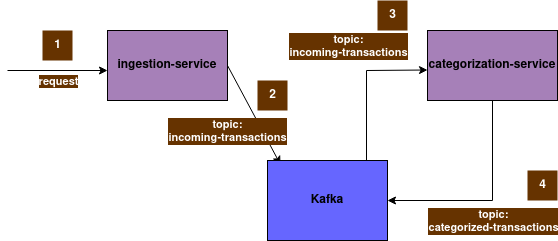

# Spring Boot - Kafka - Zipkin
This scenario includes two Spring Boot microservices:
- The `ingestion-service` implements a Kafka producer to publish incoming requests to a `incoming-transactions` topic.
It receives requests from the endpoint `/ingestion-service/transactions`.
A Swagger OpenAPI definition is published and accessible in http://localhost:8080/swagger-ui.html after running the service.
That Swagger UI can be used to send requests to the service, or just running a curl command similar to 

```bash
$ curl 'http://localhost:8080/ingestion-service/transactions' \
  -H 'Content-Type: application/json' \
  -d '{"transactionId": 168}'
```
- The `categorization-service` polls the transactions from the `incoming-transactions` topic, categorizes them following a dumb modulo rule, and finally publishes them to the `categorized-transactions` topic.



A docker compose file `compose.yml` it's included to set up all the infrastructure needed to run the services.
It includes a Kafka cluster with two brokers and a script to create the two topics:
- `incoming-transactions`
- `categorized-transactions`

Assuming your computer has already installed docker and docker compose the command `docker compose up -d` should set up all the Kafka environment.

The `compose.yml` file also includes a Zipkin server to whom both services are configured to send its traces all the way from the originating `ingestion-service` request down to the `categorization-service` Kafka publishing.
That Zipkin server is configured to run in http://localhost:9411/ by default.


### Dependencies
To run the scenario the pre-requisites are a jdk-17 and a docker engine including docker compose.  

### Reference Documentation
For further reference, please consider the following sections:

* [Docker Compose Support](https://docs.spring.io/spring-boot/docs/3.1.4/reference/htmlsingle/index.html#features.docker-compose)
* [Spring for Apache Kafka](https://docs.spring.io/spring-boot/docs/3.1.4/reference/htmlsingle/index.html#messaging.kafka)
* [Getting Started with Distributed Tracing](https://docs.spring.io/spring-boot/docs/3.1.4/reference/html/actuator.html#actuator.micrometer-tracing.getting-started)
